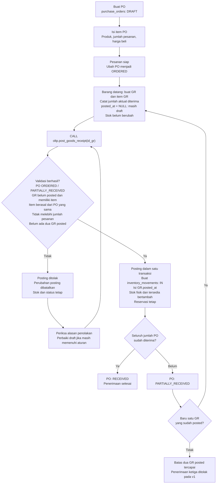
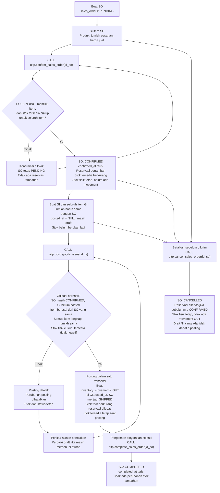

# Diagram Proses Inbound dan Outbound

## Inbound — Pembelian sampai Stok Masuk

```mermaid
flowchart TD
    A["Buat PO<br/>purchase_orders: DRAFT"] --> B["Isi item PO<br/>Produk, jumlah pesanan, harga beli"]
    B --> C["Pesanan siap<br/>Ubah PO menjadi ORDERED"]
    C --> D["Barang datang: buat GR dan item GR<br/>Catat jumlah aktual diterima<br/>posted_at = NULL: masih draft<br/>Stok belum berubah"]
    D --> E["CALL oltp.post_goods_receipt(id_gr)"]
    E --> F{"Validasi berhasil?<br/>PO ORDERED / PARTIALLY_RECEIVED<br/>GR belum posted dan memiliki item<br/>Item berasal dari PO yang sama<br/>Tidak melebihi jumlah pesanan<br/>Belum ada dua GR posted"}
    F -->|Tidak| G["Posting ditolak<br/>Perubahan posting dibatalkan<br/>Stok dan status tetap"]
    G --> H["Periksa alasan penolakan<br/>Perbaiki draft jika masih memenuhi aturan"]
    H --> E
    F -->|Ya| I["Posting dalam satu transaksi<br/>Buat inventory_movements: IN<br/>Isi GR.posted_at<br/>Stok fisik dan tersedia bertambah<br/>Reservasi tetap"]
    I --> J{"Seluruh jumlah PO<br/>sudah diterima?"}
    J -->|Ya| K["PO: RECEIVED<br/>Penerimaan selesai"]
    J -->|Belum| L["PO: PARTIALLY_RECEIVED"]
    L --> M{"Baru satu GR<br/>yang sudah posted?"}
    M -->|Ya| D
    M -->|Tidak| N["Batas dua GR posted tercapai<br/>Penerimaan ketiga ditolak pada v1"]
```

## Outbound — Pesanan sampai Pengiriman Selesai

```mermaid
flowchart TD
    A["Buat SO<br/>sales_orders: PENDING"] --> B["Isi item SO<br/>Produk, jumlah pesanan, harga jual"]
    B --> C["CALL oltp.confirm_sales_order(id_so)"]
    C --> D{"SO PENDING, memiliki item,<br/>dan stok tersedia cukup<br/>untuk seluruh item?"}
    D -->|Tidak| E["Konfirmasi ditolak<br/>SO tetap PENDING<br/>Tidak ada reservasi tambahan"]
    E --> C
    D -->|Ya| F["SO: CONFIRMED<br/>confirmed_at terisi<br/>Reservasi bertambah<br/>Stok tersedia berkurang<br/>Stok fisik tetap, belum ada movement"]
    F --> G["Buat GI dan seluruh item GI<br/>Jumlah harus sama dengan SO<br/>posted_at = NULL: masih draft<br/>Stok belum berubah lagi"]
    G --> H["CALL oltp.post_goods_issue(id_gi)"]
    H --> I{"Validasi berhasil?<br/>SO masih CONFIRMED, GI belum posted<br/>Item berasal dari SO yang sama<br/>Semua item lengkap, jumlah sama<br/>Stok fisik cukup, tersedia tidak negatif"}
    I -->|Tidak| J["Posting ditolak<br/>Perubahan posting dibatalkan<br/>Stok dan status tetap"]
    J --> K["Periksa alasan penolakan<br/>Perbaiki draft jika masih memenuhi aturan"]
    K --> H
    I -->|Ya| L["Posting dalam satu transaksi<br/>Buat inventory_movements: OUT<br/>Isi GI.posted_at, SO menjadi SHIPPED<br/>Stok fisik berkurang, reservasi dilepas<br/>Stok tersedia tetap saat posting"]
    L --> M["Pengiriman dinyatakan selesai<br/>CALL oltp.complete_sales_order(id_so)"]
    M --> N["SO: COMPLETED<br/>completed_at terisi<br/>Tidak ada perubahan stok tambahan"]
    B --> O["Batalkan sebelum dikirim<br/>CALL oltp.cancel_sales_order(id_so)"]
    F --> O
    G --> O
    O --> P["SO: CANCELLED<br/>Reservasi dilepas jika sebelumnya CONFIRMED<br/>Stok fisik tetap, tidak ada movement OUT<br/>Draft GI yang ada tidak dapat diposting"]
```
